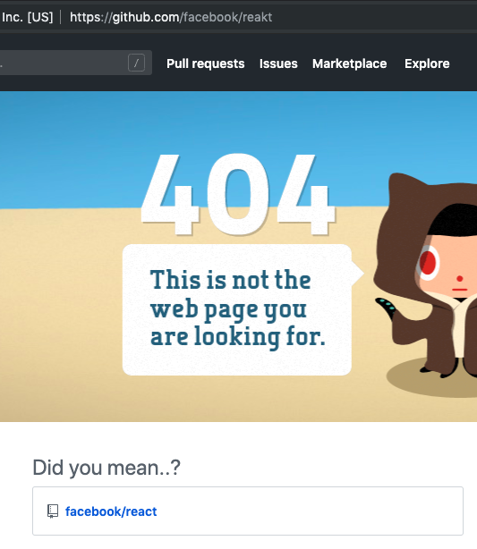

     
    
    

# "Did you mean...?" for GitHub
`"Did you mean...?" for GitHub` is a browser extension that suggests repositories that have a similar name when you encounter a 404 error.

Demo:

When trying to access "https://github.com/facebook/reakt", GitHub gives a 404 error. You probably meant to go to "https://github.com/facebook/react" so this extension suggests you the correct repository.

## Installation
"Pin for GitHub" is availible through the [Firefox Add-On Platform](https://addons.mozilla.org/en-US/firefox/addon/did-you-mean-for-github/) and [chrome web store](https://chrome.google.com/webstore/detail/did-you-mean-for-github/...).
You can also install this extension by downloading the source from GitHub and loading the unpacked extension through "about:debugging" as a "Temporary Add-On".

## How it works
The extension uses three different techniques to try to find the repository you were looking for:
1. It has a build-in list of over 800 popular GitHub repositories and tries to find similar names.
2. It has a build-in list of over 200 popular GitHub accounts and tries to see if the username might be spelled incorrectly
3. It has a build-in english dictionary. It splits the name of the repository (e.g. if it is camelCase or dash-case) and searches for similar english words

The extension calculates the [Damerau-Levenshtein distance](https://en.wikipedia.org/wiki/Damerau%E2%80%93Levenshtein_distance) to find similarity between strings.

Optionally, you can provide a GitHub API token. In this case, the extension will query the GitHub GraphQL API for the possible repository names generated above to filter out repositories that don't exist.

## Contributing
Please fork this repository and create a new pull request to contribute to it.

If you notice any errors, please create a new issue on GitHub.

## License
Licensed under the [MIT License](LICENSE)